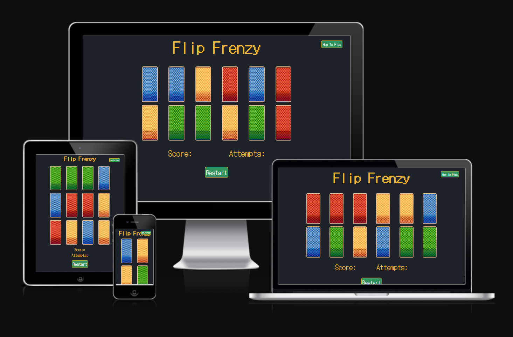
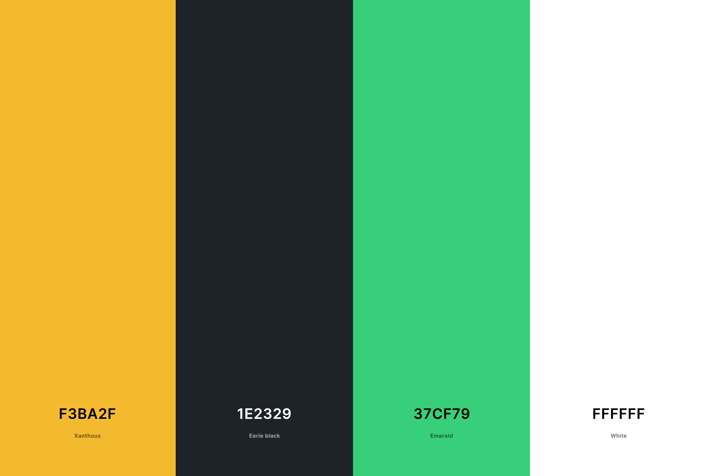
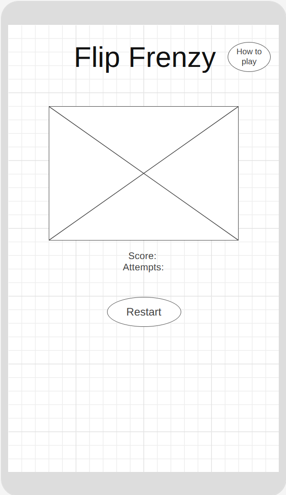
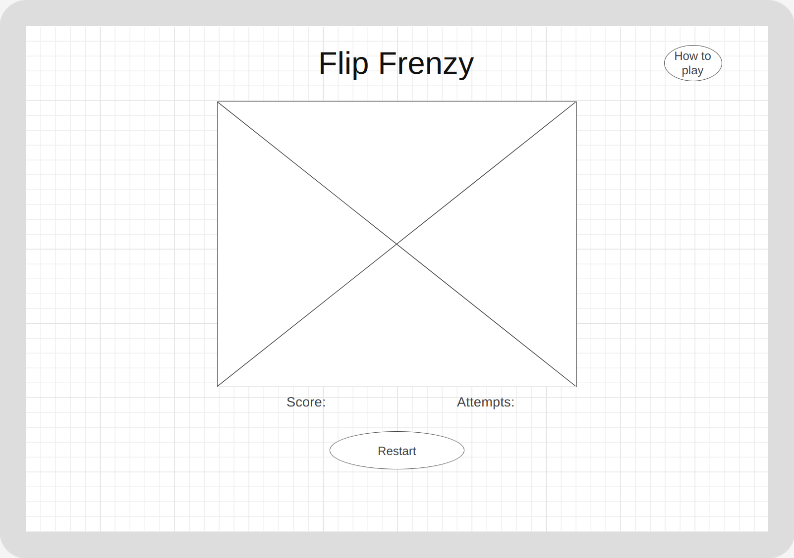
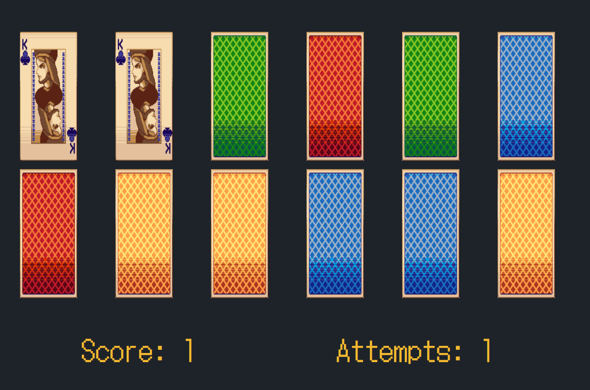
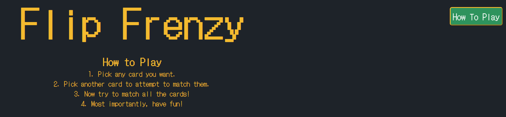
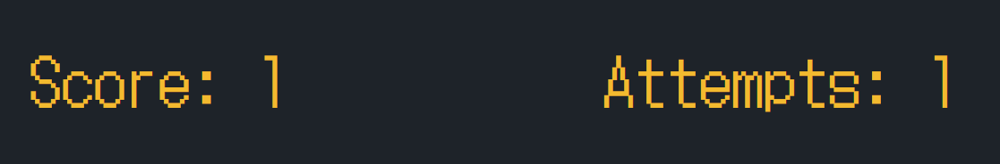

# [FLIP FRENZY](https://conor-timmis.github.io/Flip-Frenzy)

Welcome to Flip Frenzy. My page is dedicated to your usual memory card flip game, but with a slight twist featuring a 16-bit theme. I have chosen this game to rebuild because I would like to capture a time I enjoyed when I was younger and could play this for hours. The reason I have chosen a 16-bit theme is to make it clean but also nostalgic in a sense, I thought this would be a nice touch as someone that used to enjoy games even when they were graphically inferior. 

My target is for anyone who wants to enjoy a free game that wants to try something fun and simple, no setup needed. They should want to reflect a bit subconsciously in the old graphics I've used also though, it's not entirely necessary to do it or want to do it, mainly for some food for thought. I think this will be a good way to unwind and move away from the stresses of work you may have on a daily basis, and the fact it is themed around nostalgia could be refreshing to many people. You truly don't need to be a gamer or even close to lose yourself in Flip Frenzy for a while!

## UX

In this section, I'll talk about how the design process went for Flip Frenzy. I originally wanted to create a memory card flip game, but as I found different ones and looked at how they were approaching it, I realised that I would prefer if it was more traditional with how it appears, some looked too modern to fit how I'm used to seeing it. I used to play a version on the Nintendo DS, and the Super Mario Bros game for it came with a memory card flip game that I can remember clearly, casino themed with traditional cards except they had the characters on them instead. I went with a more oldschool feel for the game for nostalgia and decided to go with 16-bit assets to fit the theme a bit more. I didn't want to make the game "look" too crazy in case it threw people off and caused any confusion, as it's supposed to be a simple game with a simple goal, but with a lot of fun. The game mechanics involved are basic but can easily be enjoyed regardless with replayability on top.

### Colour Scheme

- `#F3BA2F` used for primary text.
- `#1E2329` used for background colour.
- `#37cf79` used for primary button colour.
- `#FFFFFF` used for button text.

I used [coolors.co](https://coolors.co/) to generate my colour palette.

### Typography

- [DotGothic16](https://fonts.google.com/specimen/DotGothic16) Is used for everything text-related within the page. I have chosen this to fit the nostalgic theme I have chosen to go with for the game.
- Sans-serif is in place to fall back on for all elements.

## User Stories

As a new player, I want to be able to enjoy the game in my free time.
As a new player, I should be able to figure out how to play seamlessly and be able to replay if I choose to.
As a new player, I would like to be able to track my scores to see how I am doing.

### New Site Users

- As a new site user, I would like to learn how to play initially and during gameplay, so that I can figure out how to play.
- As a new site user, I would like to engage myself in the content, so that I can play till my hearts content.
- As a new site user, I would like to have a clean game layout, so that I can know what I'm looking at without any trouble.
- As a new site user, I would like to see social links, so that I can check in with the developer for future news about the game.
- As a new site user, I would like to be able to see other players scores, so that I can compare my scores.

### Returning Site Users

- As a returning site user, I would like to see new game updates, so that I can enjoy the same game but with new twists.
- As a returning site user, I would like to be able to track new information, so that I can see how many matches I've played for example.
- As a returning site user, I would like to be a loyal player, so that I can potentially earn rewards.
- As a returning site user, I would like to see some community building, so that I can join in and read about potential future features of the game.
- As a returning site user, I would like to be able to create profiles, so that I can see how I am doing compared to other players.

## Wireframes

### Mobile Wireframes

Home
  - 

### Tablet Wireframes

Home
  - 

### Desktop Wireframes

Home
  - 

## Features

### Existing Features

- **Flip Card Game**

    - The game for my page is a Memory Card Flip game, the way to play the game is by finding a card and matching it with the same one that's flipped across the board. Every single game the cards are randomised so not every game is the same thing over and over and makes it very good for replayability, I have also implemented a way for the backside of the cards to be randomised to further throw users off the trail when trying to match.

- **Restart Button**

    - The restart button is used to stop your current game and start from fresh, but also to reset when you have completed a round and want to play again.

- **How to Play Button**

    - The how to play button is useful to press as you will be able to display how you play the game at any point if you are unsure what to do, once pressed it will push down on the rest of the page and display the 4 rules I have put in place to fully understand what to do within the game. You can press it again to hide the rules again when you are done reading.

- **The Tracker**

    - The tracker is the display I've made to allow you to keep track of your points and attempts throughout games. The points are based on how many pairs of cards you match, the attempts display is how many times you have tried throughout a game.

### Future Features

- Games Won in Addition to Tracker
    - I'd like to make it so the game can track how many games you've played through all in all, even when you leave the page one day and come back another.
- Feedback Section/Contact  
    - I want to expand and make the page further but to do that I also need ideas and feedback to make sure there aren't any bugs down the road. I think a page or a form with a way to contact me would be the easiest way to expand as I can take ideas I like and implement them how I want to, or how the user wants to.
- Difficulty Changing
    - I would like to implement more cards to be able to flip within one game, so it makes the game much more challenging, and possibly a life system so you can't always win.
   

## Tools & Technologies Used

- [HTML](https://en.wikipedia.org/wiki/HTML) used for the main site content.
- [CSS](https://en.wikipedia.org/wiki/CSS) used for the main site design and layout.
- [JavaScript](https://www.javascript.com) used for user interaction on the site.
- [CSS Flexbox](https://www.w3schools.com/css/css3_flexbox.asp) used for an enhanced responsive layout.
- [CSS Grid](https://www.w3schools.com/css/css_grid.asp) used for an enhanced responsive layout.
- [GitHub](https://github.com) used for secure online code storage.
- [GitHub Pages](https://pages.github.com) used for hosting the deployed front-end site.
- [Gitpod](https://gitpod.io) used as a cloud-based IDE for development.
- [Git](https://git-scm.com) used for version control. (`git add`, `git commit`, `git push`)

## Testing

For all testing, please refer to the [TESTING.md](TESTING.md) file.

## Deployment

The site was deployed to GitHub Pages. The steps to deploy are as follows:

- In the [GitHub repository](https://github.com/conor-timmis/Flip-Frenzy), navigate to the Settings tab 
- From the source section drop-down menu, select the **Main** Branch, then click "Save".
- The page will be automatically refreshed with a detailed ribbon display to indicate the successful deployment.

The live link can be found [here](https://conor-timmis.github.io/Flip-Frenzy)

### Local Deployment

This project can be cloned or forked in order to make a local copy on your own system.

#### Cloning

You can clone the repository by following these steps:

1. Go to the [GitHub repository](https://github.com/conor-timmis/Flip-Frenzy) 
2. Locate the Code button above the list of files and click it 
3. Select if you prefer to clone using HTTPS, SSH, or GitHub CLI and click the copy button to copy the URL to your clipboard
4. Open Git Bash or Terminal
5. Change the current working directory to the one where you want the cloned directory
6. In your IDE Terminal, type the following command to clone my repository:
	- `git clone https://github.com/conor-timmis/Flip-Frenzy.git`
7. Press Enter to create your local clone.

Alternatively, if using Gitpod, you can click below to create your own workspace using this repository.

Please note that in order to directly open the project in Gitpod, you need to have the browser extension installed.
A tutorial on how to do that can be found [here](https://www.gitpod.io/docs/configure/user-settings/browser-extension).

#### Forking

By forking the GitHub Repository, we make a copy of the original repository on our GitHub account to view and/or make changes without affecting the original owner's repository.
You can fork this repository by using the following steps:

1. Log in to GitHub and locate the [GitHub Repository](https://github.com/conor-timmis/Flip-Frenzy)
2. At the top of the Repository (not top of page) just above the "Settings" Button on the menu, locate the "Fork" Button.
3. Once clicked, you should now have a copy of the original repository in your own GitHub account!

### Local VS Deployment

I haven't noticed any issues between my Offline and Github Pages versions of the page.

## Credits

I found a lot of help in my project through [JavaScript Academy](https://www.youtube.com/@JsAcademyOfficial) with the use of [this video](https://www.youtube.com/watch?v=xWdkt6KSirw) to help me with structure and to get me going in the right direction.
I was guided by my mentor [Tim Nelson](https://github.com/TravelTimN) on what I should look out for during the pages development.
I used [W3schools](https://www.w3schools.com/howto/howto_css_flip_card.asp) "How to Flip Card" section to fix my game towards the end, as I was having some very specific issues with how they flipped and how they rendered differently between Gitpod's live page feature & Github Pages.
