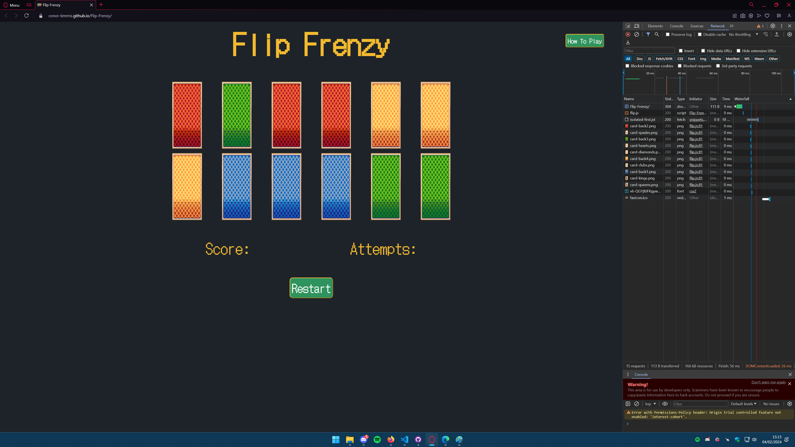
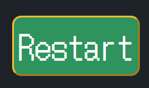
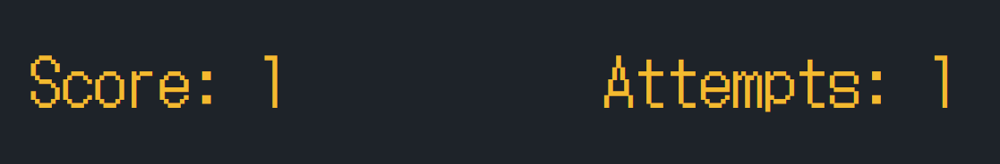
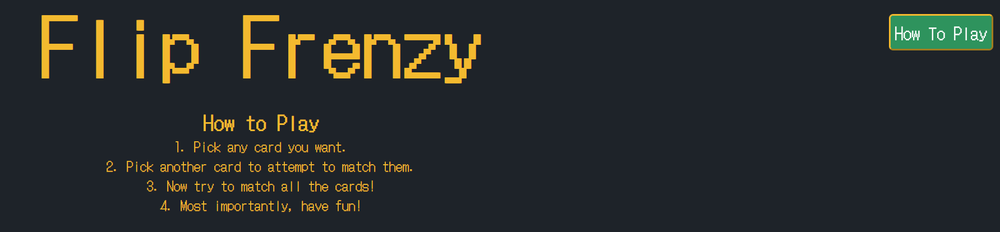

# Testing

Return back to the [README.md](README.md) file.

## Code Validation

I have used the recommended [HTML W3C Validator](https://validator.w3.org) to validate all of my HTML files.

- https://validator.w3.org/nu/?doc=https%3A%2F%2Fconor-timmis.github.io%2FFlip-Frenzy%2Findex.html

### CSS

I have used the recommended [CSS Jigsaw Validator](https://jigsaw.w3.org/css-validator) to validate all of my CSS files.

- https://jigsaw.w3.org/css-validator/validator?uri=https%3A%2F%2Fconor-timmis.github.io%2FFlip-Frenzy

My page is showing no errors, but is showing 1 warning, with the use of the "-webkit" vendor extension style I have opted to use to work around an issue I was facing.

### JavaScript

I have used the recommended [JShint Validator](https://jshint.com) to validate all of my JS files.

## Browser Compatibility

I've tested my deployed project on multiple browsers to check for compatibility issues.

| Browser | Home | Notes |
| --- | --- | --- |
| Chrome |  | Works as expected |
| Firefox |  | Works as expected |
| Edge |  | Shows errors irrelevant to page in console |
| Opera GX |  | Works as expected |

## Responsiveness

I've tested my deployed project on multiple devices to check for responsiveness issues.

| Device | Home | Notes |
| --- | --- | --- |
| Mobile (DevTools) |  | Works as expected |
| Tablet (DevTools) |  | Works as expected |
| Desktop |  | Works as expected |

## Lighthouse Audit

I've tested my deployed project using the Lighthouse Audit tool to check for any major issues.

| Page | Audit | Notes |
| --- | --- | --- |
| Home |  | Minor issue relating to Google Fonts with response time |

## User Story Testing

| User Story | Screenshot |
| --- | --- |
| As a new site user, I would like to restart the game on completion, so that I can play again. |  |
| As a new site user, I would like to track my score, so that I can see how well I am doing within the game. |  |
| As a new site user, I would like to find out how to play, so that I can put my skills to the test. |  |

## Bugs

One bug I would like to mention, though fixed, is when I would have problems with the display of the cards. It started with specifying the directory of the cards incorrectly, as it would act differently between Gitpod's Live Page and Github Pages. Once fixed, I came across a weird rendering issue/bug that would let me play the game perfectly fine on Firefox, but not on anything else. In the end I had to find a way to "re-write" what I had to fix it, and found the W3Schools page I mentioned in the README originally. This page helped me re-structure and helped me make sure things were working properly again.

## Unfixed Bugs

There are no remaining bugs that I am aware of.
